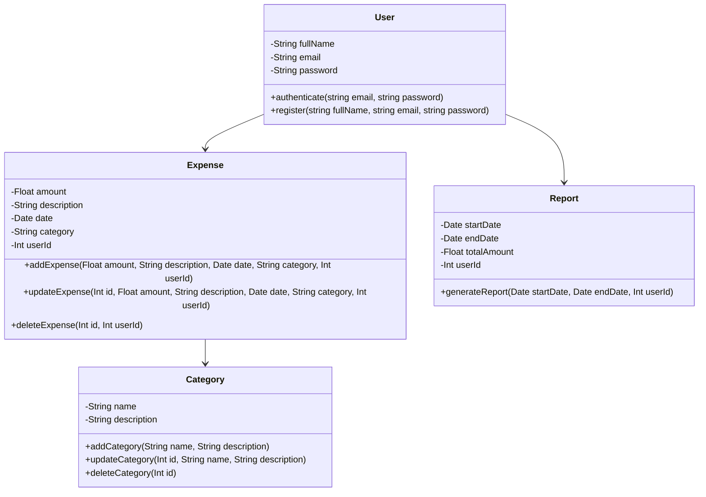

```mermaid
---
Expense Management System
---

classDiagram
    class User {
    -String fullName
    -String email
    -String password
    +authenticate(string email, string password)
    +register(string fullName, string email, string password)
    }
    class Expense {
    -Float amount
    -String description
    -Date date
    -String category
    -Int userId
    +addExpense(Float amount, String description, Date date, String category, Int userId)
    +updateExpense(Int id, Float amount, String description, Date date, String category, Int userId)
    +deleteExpense(Int id, Int userId)
    }
    class Category {
    -String name
    -String description
    +addCategory(String name, String description)
    +updateCategory(Int id, String name, String description)
    +deleteCategory(Int id)
    }
    class Report {
    -Date startDate
    -Date endDate
    -Float totalAmount
    -Int userId
    +generateReport(Date startDate, Date endDate, Int userId)
    }
    User --> Expense
    Expense --> Category
    User --> Report
```
